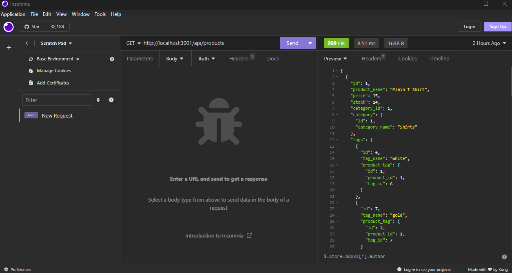

# E-commerce Back End 

# Description

Starter code was provided, this project was to build the back end code for an e-commerce site. Worked with Express.js API and to use sequilize to interact with a MySQL database.

# Installation

Do an npm i in order to ensure all necessory packages are installed.

# Usage
- In  the terminal, do msysql -u root -p and enter your MySQL password when prompted for it.
- Once logged in, do source db/schema.sql and then quit MySQL.
- npm run seed in the terminal
- npm start
- Then you can test functionality in Insomnia. 

[Video](https://drive.google.com/file/d/10DZ3RNu_c52_7mdEdrrV8euz_1qDkqIs/view) walkthrough

# Credit

[LINK](https://github.com/coding-boot-camp/fantastic-umbrella) to starter code.